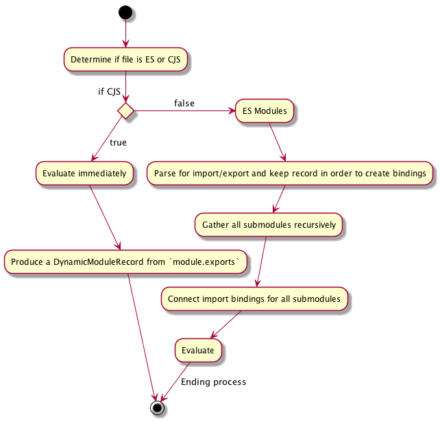

<!--
今一番 Node.js の中で hot な discussion の一つと言えるでしょう、<span style="color: #ff5252"><b>『ES Modules が Node.js の中でどうなるか』</b></span>です。
-->

Node.js team has lots of discussion day by day. Today I will introduce one of the hottest discussion on Node.js.

The discussion is <span style="color: #ff5252"><b>"How do we handle ES Modules on Node.js"</b></span>

<!--
# ES Modules 現況
-->

# ES Modules spec status

<!--
ES2015 が発刊されてそろそろ一年です。 ES2015 にある機能は Node.js v6でも 93% 程度カバーされています。モダンブラウザでも大体が90%を超えています。しかし、 ES Modules だけはまだどのブラウザも実装しきれていません(kangax compat table は ES Modules は省かれてます)。
-->

ECMAScript 2015 has been published almost 1 year ago. Node.js v6 supports 93% ES2015 syntax and features. On the other hand, almost modern browsers exceeds 90%. However, every browsers and Node.js have not supported ES Modules yet. (note: kangax combat table does not have ES Modules column)


<!--
そもそも ECMAScript 2015 自身で定義されたのは構文だけなので、構文はともかく、どうやってモジュールを取ってくるかという Loader の部分がまだ決まりきっていません。
-->

ECMAScript 2015 defines ES Modules syntax but ECMAScript does not define Loader specification. the spec will be defined by whatwg, but the Loader spec is not defined at the moment.

https://whatwg.github.io/loader/

<!--
現時点はいくつも決めなきゃいけないポイントがあって
の全てを決めて一旦ロードマップ上のMilestone 0 が達成されるような状況です。
-->

Loader spec needs to define the following discussion items for Milestone 0 on the roadmap.

https://github.com/whatwg/loader/blob/master/roadmap.md

<!--
- 参照解決処理
- 取得処理
- script タグでどう書くのか
- メモ化処理(所謂caching)
-->

- Name resolution
- Fetch Integration
- how to describe script tag  <script type='module'></script>
- memorization

<!--
scriptタグでどう書くのか、参照解決処理など、ある程度決まっている処理はありますが、どの項目もまだ議論中です（[少なくとも github 上ではまだ  milestone 0 を discussion している最中に見える](https://github.com/whatwg/loader/issues?utf8=%E2%9C%93&q=is%3Aissue+is%3Aopen+milestone+0+)）。各種ブラウザでも、実装が始まっているところはありますが、仕様の方針待ちなところが多いです。
-->

[Module script tag has been defined under whatwg-html team](https://blog.whatwg.org/js-modules) but, the other items are still under discussion. you could check [the discussion status](https://github.com/whatwg/loader/issues?utf8=%E2%9C%93&q=is%3Aissue+is%3Aopen+milestone+0+)) in GitHub.
Some browser (Webkit, V8, Firefox) start implementation, but most browser has been waiting for spec definition.

<!--
# なんで Node.js に ES Modules が必要なのか
-->

# Why Node.js needs ES Modules ??

<!--
ES Modules の仕様が定義されるよりも前に Node.js は CommonJS と呼ばれるモジュールシステムを採用しました((（正確には CommonJS の仕様からは大分外れてます。今やあれが CommonJS という事になっちゃってますが・・・）))。それと npm というパッケージマネージャの組み合わせでエコシステムを作っています。結果として npm のエコシステムは Node.js にとどまらず、Browserify や webpack を組み合わせてフロントエンドにとっても大きなエコシステムになっています。
-->

6 - 7 years ago, ES Modules did not appear in specs, Node.js has decided to use CommonJS. CommonJS and npm create JavaScript ecosystem. And `browserify` and `webpack` bring CommonJS to browser and solve module problems gracefully. As a result, the ecosystem involves both server-side JS and client-side JS. The ecosystem is growing up hugely and rapidly.

<!--
<span style="color: #d32f2f"><b>『CommonJS で既に育ってしまった生態系の中で ES Modules という標準仕様とどうやって相互運用性(interoperability)を取るのか』</b></span>
これが ES Modules が定義され始めた最初からずっと Node.js / npm で語られてる事でした。
-->

<span style="color: #d32f2f"><b>"How do we take interoperability between *standard* ES modules and CommonJS on big ecosystem?"</b></span>

At the beginning of ES Modules on spec, this question is discussed on GitHub issues.

<!--
相互運用性がないとこれまでのエコシステムと乖離(friction)ができてしまいます。せっかく Browserify や webpack で埋めたfrontend browserとNode.js との乖離がこれでまた起きることになります。
-->

Browserify and webpack is filling up the gap between browser and server to develop easily.
If we lose the interoperability, there is a possibility of friction between existing ecosystem and standard spec. If front-end developers choose ES Modules as defact, server-side engineers use CommonJS, the gap will be widen.

<!--
# Node.js ではじゃあどうしようとしているのか
-->

# Current interop proposal on Node.js

<!--
これではイカン、という事で [Bradley Meck](https://twitter.com/bradleymeck) 氏が interop を取ろうと Proposal を書き起こしました。最初に Proposal を書いた時は議論がいくつもあったので [ものすごくたくさんの話が巻き起こってまとまらなかった](https://github.com/nodejs/node-eps/pull/3) のですが、何度も何度も議論を重ねて今やっと `DRAFT` というステータスになっています。 
-->

[Bradley Meck](https://twitter.com/bradleymeck) has written a proposal for interoperability between CommonJS and ES Modules. [This link](https://github.com/nodejs/node-eps/pull/3) is the Pull-Request of the proposal, there are lots of comments and discussion. But he carries out the discussion, and the PR is merged as `DRAFT` status.

[https://github.com/nodejs/node-eps/blob/master/002-es6-modules.md](https://github.com/nodejs/node-eps/blob/master/002-es6-modules.md)

NOTE: `DRAFT` status does not mean ES modules will be implemented in node core. `DRAFT` is the status on the discussion table. If node core team decides ES modules need to be implemented in core, the status will change to `ACCEPTED`. If we decide no need to implement ES Modules, next status may be changed to `REJECTED`.

<!--
## ES Modules on Node.js 概要
-->

## ES Modules interop on Node.js

<!--
おおまかな解決アルゴリズムを記述します。
-->

The following algorithm is for the interop between ES Modules and CommonJS.

<!--
```
1.  読み込もうとしているファイルが CommonJS で定義されているのか ES Modules で定義されているのかを確認する(※)
2. もし CommonJS なら
  2-1. ファイルを即時評価する（今まで通り）
  2-2. DynamicModuleRecord に `module.exports` で読み込んだものを入れる
3. もし ES Modules なら
  3-1. ファイルをパースする（import/export でファイルを取得して、bindingを作るため）
  3-2. 再帰的に全ての依存関係のあるファイルを持ってくる
  3-3. 全ての依存関係のファイルから `import`  の binding を作る
  3-4. 評価する
```
-->

```
1. Determine if file is ES or CommonJS (CJS).
2. If CJS
  1. Evaluate immediately
  2. Produce a DynamicModuleRecord from `module.exports`
3. If ES
  1. Parse for `import`/`export`s and keep record, in order to create bindings
  2. Gather all submodules by performing loading dependencies recursively
  3. Connect `import` bindings for all relevant submodules
  4. Evaluate
```

<!--
簡易フローチャートで書くとこうですね。
-->



<!--
この後さらにケースとしてはファイルが循環参照されてたらどうするかとかの話がありますが、一旦そこは置いておきます。
-->

<!--
`読み込もうとしているファイルが CommonJS で定義されているのか ES Modules で定義されているのかを確認する` ここが今のところ最大の議論のポイントです。
-->

*`Determine if file is ES or CommonJS`* is the discussion point.

<!--
CommonJS なのか ES Modules なのかの確認方法ですが、読み込もうとしているファイルが<span style="color: #d32f2f"><b> `.mjs` の拡張子だったら ES Modules、それ以外の `.js` 等であれば普通に CommonJS として判断しよう</b></span>としています。
-->

According to current proposal,  <span style="color: #d32f2f"><b>if file extension is `.mjs`, then the file will load as ES Modules, but the other extensions, node will load the script as CommonJS</b></span>.

<!--
つまり、 CommonJS でも ES Modules でも両方共読み込ませたいモジュールを作る場合、 `package.json` に下記のように記述し、
-->

For example, if developers would like to create a module and export both styles (CommonJS and ES Modules), `package.json` will be defined:

```javascript
{
  "name": "test",
  "version": "0.0.1",
  "description": "",
  "main": "./index", // no file extension
}
```

<!--
`index.mjs` と `index.js` を定義します、片方には ES Modules 形式で書きます。
-->

The package need to have `index.mjs` and `index.js`. `index.mjs` is ES Modules style (using export/import syntax).

```javascript
// index.mjs
export default class foo {
  //..
}
```

<!--
もう片方には CommonJS 形式で書きます。
-->

The other `index.js` is CommonJS style (using module.exports object).

```javascript
// index.js
class foo {
  // ...
}
module.exports = foo;
```

<!--
こうすると読み込む側が `.mjs` 形式に対応している Node.js であれば、 先に `.mjs` で解決しに行きます。見つからなければ `.js` の方を解決する、という動きになります。
-->

If Node.js supports `ES Modules` and `.mjs` extension, try to find `index.mjs` first. if Node.js can not find `index.mjs`, Node.js switches to find `index.js`.

<!--
## import で書く場合の path 解決方式
-->

## import syntax path resolution

We can use both `require` and `import` to find modules in `node_modules`. like that.

```javascript
import mkdirp from 'mkdirp';
require('mkdirp');
```

<!--
本筋からはそれますが、 `import` の重要なポイントなので記載しておきます。 ES Modules では Node.js が暗黙的にやっているようなスマートなパスの解決をしてくれない（現時点のローダーでは）ので気をつけましょう。
例えば、 `require` で書いた場合、 `require('./foo')` のように `.js` を削除して記載することが可能でした。
-->

You do not need to add file extensions to resolve node module. However, you would like to resolve local module using `import` syntax, you need to write file extension. 

require example:

```js
// require can load ./foo.js
require('./foo');
```

<!--

`import` でモジュール参照解決をする場合、ES Modules の仕様としては暗黙的に `.js` を保管してくれたりしないので気をつけましょう。

-->

import example: you need to add file extensions

```javascript
// the following syntax can load './foo' only
// import './foo';

// if the file is CommonJS, you need to add '.js'
import './foo.js';
// if the file is ES Modules, you need to add '.mjs'
import './bar.mjs';
```

##  ES Modules => CJS

<!--
これまでの説明だけでも分かりにくいと思うので例を上げて説明していきます。ここでは ES Modules から CommonJS で定義されたモジュールを読み込む場合です。ES Modules から CJS を「名前付きで」読み込んだ場合、 `default` というプロパティが入ります（これめっちゃ分かりにくい）。
-->

I would like to introduce samples more. 

Sample 1, Load CommonJS from ES Modules:

```javascript
// cjs.js
module.exports = {
  default:'my-default',
  thing:'stuff'
};
```

```javascript
// es.mjs

import * as baz from './cjs.js';
// baz = {
//   get default() {return module.exports;},
//   get thing() {return this.default.thing}.bind(baz)
// }
// console.log(baz.default.default); // my-default

import foo from './cjs.js';
// foo = {default:'my-default', thing:'stuff'};

import {default as bar} from './cjs.js';
// bar = {default:'my-default', thing:'stuff'};
```

<!--
値を export して、 default の値としてアサインされる例：
-->

Sample 2, export value and assing default:

```javascript
// cjs.js
module.exports = null;
```

```javascript
// es.mjs
import foo from './cjs.js';
// foo = null;

import * as bar from './cjs.js';
// bar = {default:null};
```

<!--
関数を export する例：
-->

Sample 3, export function: 

```javascript
// cjs.js
module.exports = function two() {
  return 2;
};
```

```javascript
// es.mjs
import foo from './cjs.js';
foo(); // 2

import * as bar from './cjs.js';
bar.name; // 'two' ( get function name)
bar.default(); // 2 ( assigned default function )
bar(); // throws, bar is not a function
```

## CJS => ES Modules

<!--
反対に CommonJS から ES Modules を読み込む時は下記のようになります。こちらは `export default` で export した場合は `.default` プロパティにアサインされます。
-->

Next samples are opposite direction.

<!--
export default を利用する例:
-->

Sample 1, using export default:

```javascript
// es.mjs
let foo = {bar:'my-default'};
// note:
export default foo;
foo = null; // this null value does not effect import value.
```

```javascript
// cjs.js
const es_namespace = require('./es');
// es_namespace ~= {
//   get default() {
//     return result_from_evaluating_foo;
//   }
// }
console.log(es_namespace.default);
// {bar:'my-default'}
```

<!--
export を利用する例：
-->

Sample 2, using export:

```javascript
// es.mjs
export let foo = {bar:'my-default'};
export {foo as bar};
export function f() {};
export class c {};
```

```javascript
// cjs.js
const es_namespace = require('./es');
// es_namespace ~= {
//   get foo() {return foo;}
//   get bar() {return foo;}
//   get f() {return f;}
//   get c() {return c;}
// }
```

<!--
# 今のところの議論
-->

# Current discussion 

<!--
ちょうど今盛り上がってるのには理由があって、仕様が `DRAFT` になって議論が始まった後に新しく  Counter Proposal (反対提案) が書かれました。それが [defense of dot js](https://github.com/dherman/defense-of-dot-js/blob/master/proposal.md) という Proposal です。
-->

Bradley Meck's proposal gets a counter proposal. The counter proposal name is [defense of dot js](https://github.com/dherman/defense-of-dot-js/blob/master/proposal.md) .

<!--
これは `.mjs` という拡張子で解決するのではなく、 `package.json` にフィールドを足すだけで解決させるようにしたいという Proposal です。
-->

Defense-of-dot-js will not check file extension like `.mjs`, but need to add new keys to `package.json`.

<!--
## defense of dot js の内容
-->

## Defence of dot js introduction

<!--
こちらの仕様では、基本的に完全な互換性を取るのは諦め、 ES Modules で読み込むことをベースとします。 `package.json` に `main` フィールドがある時だけはすべてのファイルが CommonJS で読み込まれます。これが基本的な仕様です。
-->

This proposal basically loads modules as ES Modules. if `package.json` has `main` field, all files are loaded as `CommonJS` .

<!--
明示的に ES Modules で読み込ませたければ `package.json` に `module` フィールドでエントリーポイントを書きます。
-->

If you want to load ES Modules explicitly, you need to write `module` field in `package.json`.

```javascript
// package.json
{
  "main": "index.js",
  "module": "module.js"
}
```

<!--
こうすると、 `module` フィールドがあれば Node.js は ES Module としてエントリポイントを見に行きます。古いバージョンの Node.js は `main` フィールドのエントリポイントを見るだけなので古いバージョンにも対応されます。
-->

After that, Node.js loads entry point as an ES Module. Old version of Node.js just checks `main` field. 

<!--
しかし、このやり方には問題が１つあります。 `module` 以外のエントリポイントを `require` から指定できません。例えば、 `lodash` とかでよく見る `require('lodash/array')` みたいな読み込み方ができません。そこでこれを解決するために `modules.root` というフィールドを利用します。
-->

If you would like to import multiple files from `require` method, you need to write `modules.root` key. For example, `lodash`, `lodash` can load other entry point like `require('lodash/array')`.

```javascript
// package.json
{
  "main": "index.js",
  "module": "module.js",
  "modules.root": "lib"
}
```

<!--
上記のように`"modules.root": "lib"` フィールドがあると `lib/*` 以下を `require` から読み込めるようになります。つまり、 ES Modules で書いてあっても `require('lodash/array')` みたいな書き方ができるようになり、ある程度互換性を保てるようになります。
-->

As above sample, `package.json` has `"modules.root": "lib"` field, `Node.js` will export `modules` from `lib/*`. So you can write `require('lodash/array')` and protect backward compatibility.

<!--
とはいえ、新しいバージョンで `main` も `module` も無い package.json では暗黙的には必ず ES Modules になってしまうので、かなり breaking changes です、その代わり拡張子での解決は要らないので、 `.mjs` などの拡張子を検討する必要はありません。なので、 "Defense of dot js" なわけです。
-->

Although, if `package.json` does not have `main` and `module`, all files are loaded as ES Modules. This may be breaking change. However, we need not to change the file extension from `.js` to `.mjs`. So that proposal name is "Defense of dot js".

<!--
## CommonJS と ES Modules 両方対応するなら？
-->

## How to support both CommonJS and ES Modules

<!--
基本的には ES Modules に傾けるのがこの仕様のポイントですが、人気のあるモジュールはそうはいきません。 ES Modules と CommonJS の両対応させる必要のあるモジュールは存在するでしょう。この時は諦めて transpile して、 ES Modules => CommonJS のファイルも用意しておきます。 transpile した JavaScript も一緒に package に入れておきます。 `main` フィールドと `module` フィールドを書いておけば古い Node.js と新しい Node.js で読み込み先を変えてくれます。
-->

Basically, Defense of dot js thinks bias towards ES Modules, but popular modules should support both CommonJS and ES Modules. If both supports are needed, we need to transpile from ES Modules and CommonJS. Transpiled JavaScript and ES Modules will be packed in one package.  And `package.json` should have `main` and `module` keys.

<!--
## Bradley Meck仕様との違い
-->

## The difference between Bradley Meck's spec and Defense of dot js

<!--
<b>Defense of dot js 側は将来的に ES Modules に全て揃えよう</b> という姿勢です。互換性をある程度損なっているし、それが起こす混乱はある程度受け入れる考えです。それに対して Bradley Meck 氏の仕様は互換性重視です。あくまで今のCommonJSと相互運用性を取るというのを主軸に添えて語られています。拡張子で ES ModulesなのかCommonJSなのかが変わるというのは言い換えれば一つ一つのファイル単位で ModuleなのかCommonJSなのかを切り替えられる柔軟な仕様です。過渡期は `.mjs` と　`.js` が混じるかもしれませんが、将来的にユーザーの判断でどっちがデファクトになるかによっては `.mjs` だけ残る可能性はあります。
-->

<b>Defense of dot js think that we need to switch ES Modules from CommonJS in the future.</b> On the other hand, Bradley Meck spec give first prioritiy to compatibility and interoperability. The spec can check opt-in load CommonJS / ES Modules by file. The file extensions are `.js` the files are loaded as `CommonJS` and the file extensions are `.mjs`, the files are loaded as `ES Modules`. 

# hard choice (.mjs vs package.json)

<!--
これに対してさらに Counter で Bradley Meck 氏はブログを書いています。
-->

Bradley Meck wrote an entry about `why we choose .mjs`.

https://medium.com/@bradleymeck/understanding-the-hard-choice-1ea3008fc9d0#.3gryiqkmv

<!--
なんで `.mjs` を選んだのか、という理由が書いてあります。
ブログの基本的な論調としてはみんな `.js` という拡張子に頼りすぎているという話です。
-->

This blog says that we should not depend on `.js` extension.

<!--
JavaScript には様々な"方言" があります。CommonJS, UMD, AMD、これらの全ての JavaScript は全て `.js` になってます。
-->

JavaScript has several dialects like CommonJS, UMD, AMD, etc. These dialects use `.js` file extension.

<!--
ES Modules というのはもうそれ単体で評価可能な Script ではないし、パースして他のファイルをロードしてチェックするという処理が必要な以上、もういっそ拡張子ごと変えるというアイデアも分からなくはないです。しかも Module だと暗黙的に strict mode で動くので、普通のScript とは別物だと思ったほうがいいです。
-->

ES Modules is not same to CommonJS, need to parse other files and execute the script in strict mode implicitly. I understand the idea to change the file extension. 

<!--
他の言語の例を挙げるなら、 `.pl` （Perl スクリプト） と `.pm` （Perl モジュール）のように拡張子を変える事を是とする文化もあります。また、ファイルを開く前に拡張子だけ見れば Module  なのか Script なのかが分かるので、人間にとっても意味はあります。
-->

In other language example, Perl uses `.pl` as Perl Script, and `.pm` as Perl Module. it is easily obvious whether Module or Script befor file open.

<!--
この仕様はまだまだ議論中です。また今週の TSC ミーティングで議論があるでしょう。先週もありましたが、話はまとまりきらずに終わりました。今のうちに何かこうしたいという意志があれば [issue](https://github.com/nodejs/node-eps/issues/13) か [PR](https://github.com/nodejs/node-eps/pulls) に書くことをおすすめします。
-->

This spec is still under discussion. If you have some opinions you should write the following issues.

- https://github.com/nodejs/node-eps/issues/13
- https://github.com/nodejs/node-eps/pulls
 
<!--
# まとめ
-->

# Conclusion

<!--
- ES Modules の現時点の状況
- ES Modules を Node.js はどうするのか
- ES Modules on Node.js Proposalの詳細
- Counter Proposal である Defense of dot js の話
-->

- ES Modules current status
- ES Modules on Node.js Proposal
- Defense of dot js
- hard choice (.mjs vs package.json)
